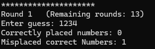

# Mastermind Game

Mastermind is a game where a user is able to play against the computer. The objective is to guess a secret 4-digit
number combination within a set amount of chances. By default, a 4-digit number combination will be generated, and the 
player has a total of 10 chances to guess the number combination. The computer will provide feedback for the player's 
guess each round, returning an output of how many digits were correctly located and how many digits were correct but
misplaced. The game continues until the player correctly guesses the number combination or when the player exhausts all 
10 attempts.

## Table of Contents
* [Installation](#installing-the-game)
  * [Prerequisites](#prerequisites) 
  * [Clone the Repository](#cloning-the-repository)
  * [Run the Application](#running-the-application)
* [Play the Game](#playing-the-game)
* [Class Structure](#class-structure)
* [Technology Used](#technologies)
* [Author](#authors)


## Installing the Game

### Prerequisites

To operate this game, the user must have access to a CLI (Command Line Interface).

(Ex: Windows user's can use *Windows Powershell* or *Terminal* applications. macOS users can use the *Terminal* 
application. IDE terminals can also be used.)


### Cloning the Repository

To download this game locally onto your device run the git clone command seen below into the CLI of your choosing. 

```
git clone https://github.com/JustineElbuhel/Mastermind_Game.git
```

### Running the Application

Once the repository has been cloned to your device, you will want to move directories to be in the correct folder. This 
can be done by inputting the commands below into your CLI.

```
cd Mastermind_Game
```
```
cd src
```
```
cd main
```
You are now ready to compile the game files, so go ahead and run the command below into the CLI.
```
javac mastermindGame/*.java
```
You are now one step away from being able to play the game! 

## Playing the Game
At this point, you have two options to start the game. 

1. By default, the program can generate a random code itself, allotting 10 chances to guess the code to the player. This 
version can be played by entering the command below into the CLI. After the command is entered, the game will start.
```
java mastermindGame.Mastermind
```
2. The game can take a secret code and the number of chances a player will have per game if provided into the CLI. 
   * To set a secret code: Into the terminal command above you will add "-c {secretCode}"
   * To set the amount of chances to guess the code: Into the command above you will add "-r {maxRounds}"

*Ex:*

Secret Code: 1234 & Rounds per game: 3
```
java mastermindGame.Mastermind -c 1234 -r 3 
```
Secret Code: Randomly generated & Rounds per game: 3
```
java mastermindGame.Mastermind -r 3
```
Secret code: 1234 & Rounds per game: 10
```
java mastermindGame.Mastermind -c 1234
```

After entering one of the four commands above, the game will start!

### Game Rules 
* The secret code will always be a 4-digit number, with numbers ranging from (0-7).
* Each player will have a maximum amount of chances to guess the secret code.
* The computer will provide feedback after each guess from the player.
* The game ends when the player correctly guesses the secret code or when the player uses all their chances to guess the secret code.

### How to Play
After the last command above is inputted into the CLI, the game starts. You will be welcomed into the game and enter into
round one. The player will be prompted to enter their guess directly into the CLI. As long as the guess is a 4-digit number,
the CLI will output a response according to the player's guess. 

*Ex CLI during a round:*



The player can guess as many times as there are remaining rounds. The game continues on until the player either guesses 
the correct code or runs out of remaining guesses.


## Class Structure

### Mastermind
Acts as the Main file to run the application. It calls GameSettings and GamePlay to be able to play the game.

### GameSettings
Handles generating or accepting the secret code the player is trying to guess. It also handles setting the max amount of rounds per game.

Features:
* @method generateSecretCode() calls the Random Integer API to create a string for 4 random numbers ranging from (0-7). 
* @method generateSecretCode2() if generateSecretCode() GET request has a response of 503, the program will randomly generate a string of 4
random numbers ranging from (0-7)
* Can take in arguments from the CLI commands to set a secret code or the max amount of rounds. 

### GamePlay
Handles the CLI outputs and game logic. It contains the loop that represents each round and calls the logic that compares the player's guesses to the secret code.


### GameValidations
This class ensures that parameters or guesses that a user inputs into the CLI is a valid input. 

* @method checkUserInput - Checks to see if the player's guess is a 4 digit guess without any letters.
* @method validateSecretCodeArg - Checks to see if the user inputs a valid secret code for the game.
* @method validateMaxRoundsArg - Checks to see if the user inputs a valid number for setting max rounds for the game
### PiecesAlgorithm
As long as a user guess is a valid guess, this class handles the comparison between the player's guess and the secret code.


## Technologies

* [Java](https://developer.mozilla.org/en-US/docs/Web/HTML)
* [JUnit4](https://junit.org/junit4/)
* [Random Integer API](https://www.random.org/clients/http/api/)

## Authors
**Justine Elbuhel**
- [Link to GitHub](https://github.com/JustineElbuhel)
- [Link to LinkedIn](https://www.linkedin.com/)
